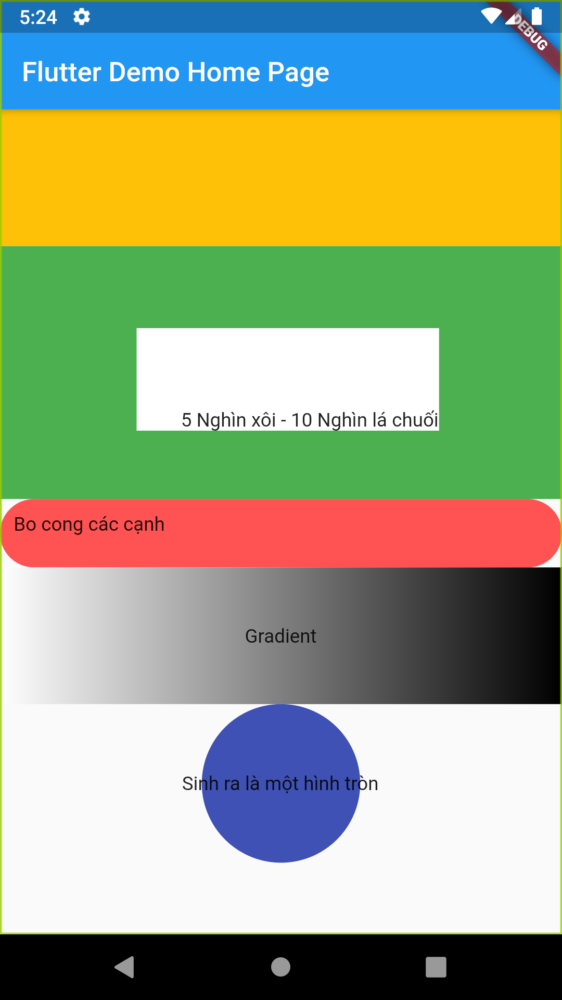

# Flutter Container

<table>

<td>
  <pre> 
  
      // Hình chữ nhật
      Container(
        height: 100,
        color: Colors.amber,
      ),

      // Hình chữ nhật trong hình chữ nhật
      Container(
        color: Colors.green,
        padding:
        EdgeInsets.only(left: 100.0, right: 90.0, top: 60, bottom: 50),
        child: Container(
          height: 75,
          color: Colors.white,
          child: Text("5 Nghìn xôi - 10 Nghìn lá chuối"),
          alignment: Alignment.bottomRight,
        ),
      ),

      // Border-radius
      Container(
        constraints: BoxConstraints.expand(height: 50.0),
        padding: EdgeInsets.all(10),
        decoration: ShapeDecoration(
            shape: RoundedRectangleBorder(
              borderRadius: BorderRadius.all(
                Radius.circular(40.0),
              ),
            ),
            color: Colors.redAccent),
        child: Text("Bo cong các cạnh"),
      ),

      // Gradient
      Container(
        constraints: BoxConstraints.expand(height: 100.0),
        alignment: Alignment.center,
        padding: EdgeInsets.all(10),
        decoration: BoxDecoration(
            gradient: LinearGradient(colors: [Colors.white, Colors.black]),
            shape: BoxShape.rectangle),
        child: Text("Gradient"),
      ),

      // Hình tròn
      Container(
        alignment: Alignment.center,
        padding: EdgeInsets.all(50),
        decoration: BoxDecoration(
            color: Colors.indigo,
            shape: BoxShape.circle),
        child: Text("Sinh ra là một hình tròn"),
      ),
  </pre>
</td>
<td>
  
</td>
</tr>
  </table>
