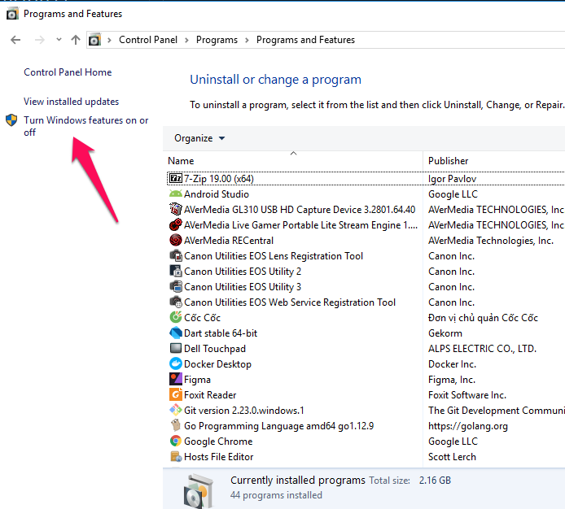
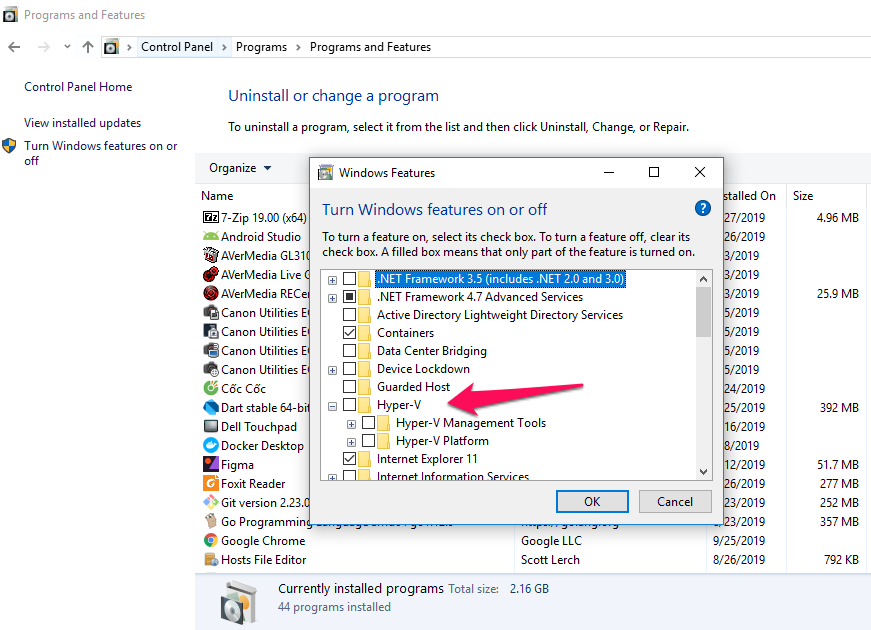
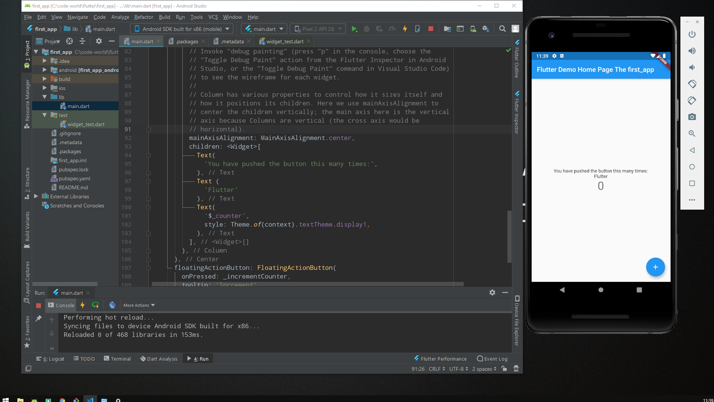
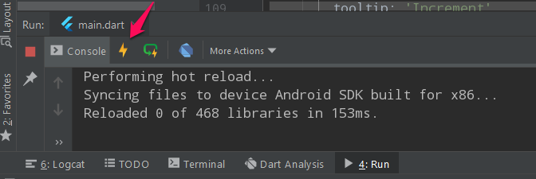

# Cài đặt Flutter trên Windows

1.[Cài đặt Flutter SDK](https://flutter.dev/docs/get-started/install)

2.[Cài đặt Dart](https://dart.dev/get-dart)

3.[Tải Android Studio](https://developer.android.com/studio)

4.[Cài đặt HAXM](https://github.com/intel/haxm/wiki/HAXM-6.x-Release-Archive)

- Lưu ý: Cài HAXM qua trang chủ intel, không cài thông qua Android Studio, sẽ gặp lỗi. Để cài được HAXM, cần tắt Hyper-V Windows10, đồng nghĩa với việc không sử dụng được `DOCKER`.





-----
5. Khởi chạy

Tạo máy ảo emulators Android Studio

Liệt kê danh sách emulators 
```
flutter emulators 
```

Khởi chạy emulators với flutter
```
flutter emulators --launch <id_emulators>
```

Khởi chạy ứng dụng Flutter

```
flutter run
```


Restart Ứng dụng
```
Ctrl-Shift-\
```


Hot reload
```
Ctrl-\
```
