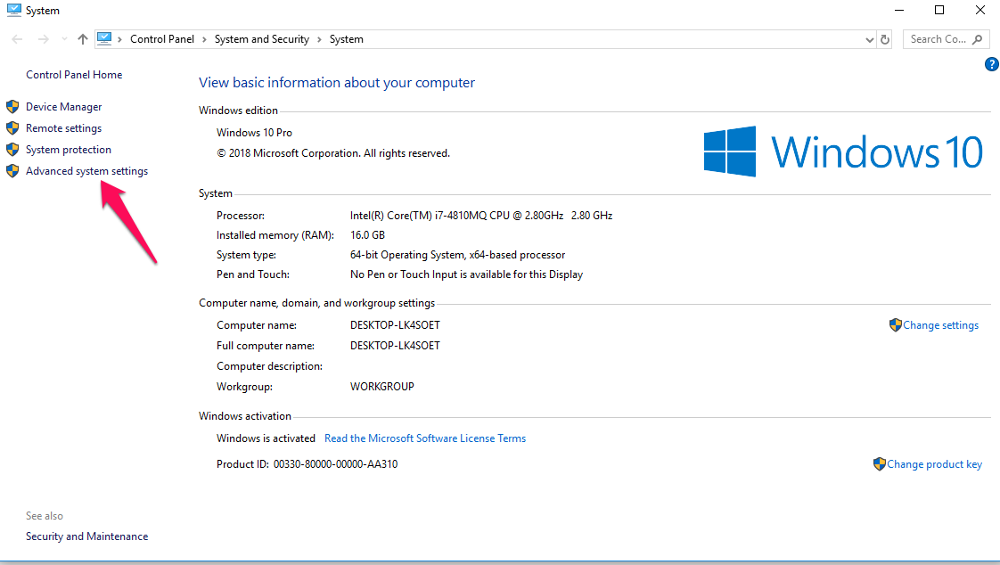
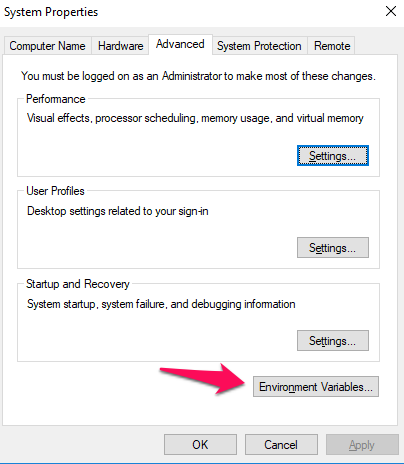
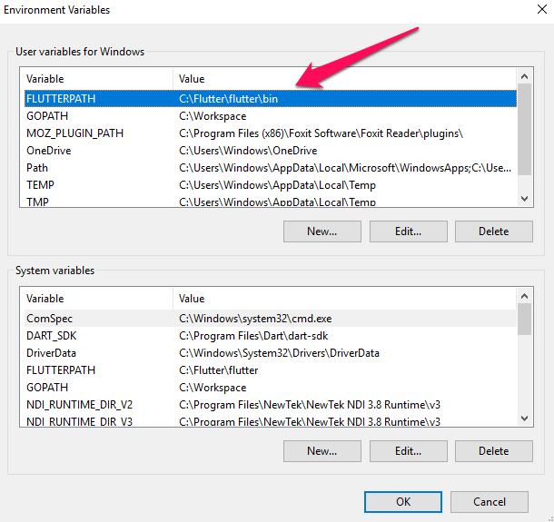
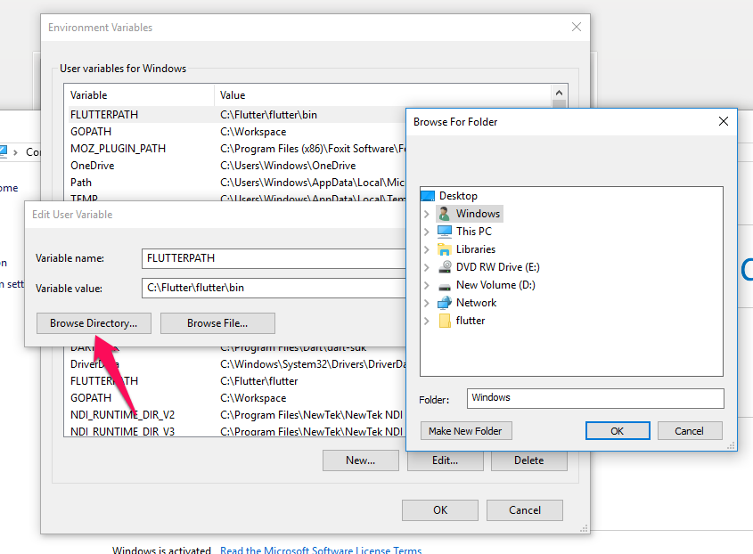
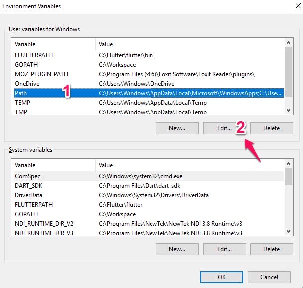
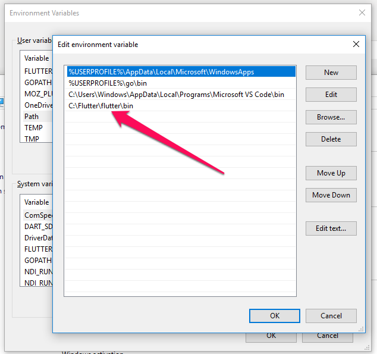

# Cài đặt biến môi trường

Chuột phải `My Computer` -> `Advanced system settings`

Thêm 1 Biến FLUTTERPATH.
Biến này sẽ trỏ đến thư mục /bin trong thư mục Cài đặt Flutter đã tải về và giải nén trước đó. Mặc định thường trong `Downloads`. Nên Copy sang đường dẫn khác (Cụ thể ở đây: `C:\Fluttler`)

Lưu ý: Thay vì gõ bằng tay, Hãy sử dụng `Brower Directory`

Thêm Đường dẫn đến thư mục /bin vào biến `$Path` mặc định của máy

Tắt toàn bộ Terminal, khởi động lại và thử với `flutter doctor`