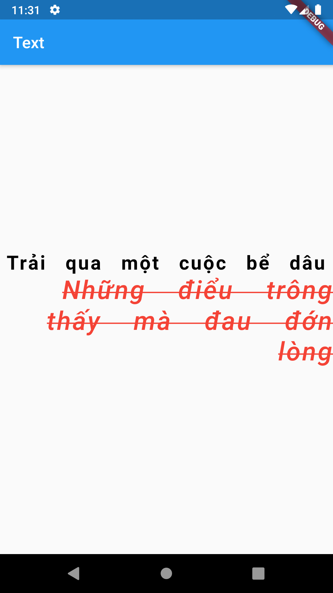

# Flutter text

<table>

<td>
  <pre> 
  Text(
    'Trải qua một cuộc bể dâu',
    textAlign: TextAlign.left,
    style: TextStyle(
        color: Colors.black,
        fontSize: 24,
        fontWeight: FontWeight.bold,
        letterSpacing: 2.0,
        wordSpacing: 15.0,
        ),
    ),
    Text(
        'Những điểu trông thấy mà đau đớn lòng',
        textAlign: TextAlign.right,
        style: TextStyle(
            color: Colors.red,
            fontSize: 32,
            fontWeight: FontWeight.w500,
            fontStyle: FontStyle.italic,
            letterSpacing: 2.0,
            wordSpacing: 30.0,
            decoration: TextDecoration.lineThrough,
            ),
    ),
    </pre>
</td>
<td>
  
</td>
</tr>
  </table>
