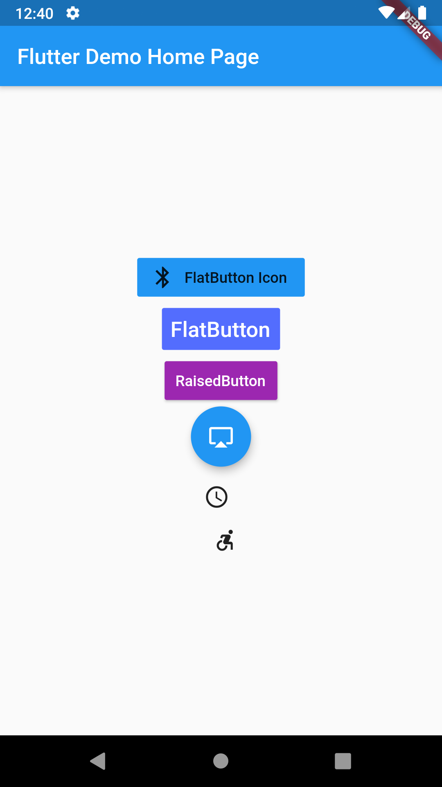

# Flutter Button

<table>

<td>
  <pre> 
  
     // FlatButton icon
    FlatButton.icon(
        color: Colors.blue,
        icon: Icon(Icons.bluetooth), //`Icon` to display
        label: Text('FlatButton Icon'), //`Text` to display
        onPressed: () {
        //Code to execute when Floating Action Button is clicked
        },
    ),

    //Flat Button
    FlatButton(
        color: Colors.indigoAccent,
        textColor: Colors.white,
        disabledColor: Colors.grey,
        disabledTextColor: Colors.black,
        padding: EdgeInsets.all(8.0),
        splashColor: Colors.blueAccent,
        onPressed: () {},
        child: Text(
        "FlatButton",
        style: TextStyle(fontSize: 20.0),
        ),
    ),
    
    // Raised Button
    RaisedButton(child: Text("RaisedButton"),
        onPressed: () {},
        color: Colors.purple,
        textColor: Colors.white,
        padding: EdgeInsets.fromLTRB(10, 10, 10, 10),
        splashColor: Colors.grey,
    ),

    // Floating Action Button
    FloatingActionButton(
        onPressed: () {},
        tooltip: 'Clip và giữ để hiện',
        child: Icon(Icons.airplay),
    ),

    // Icon lệch trái
    IconButton(
        icon: Icon(Icons.access_time),
        onPressed: () {},
        alignment: Alignment.bottomLeft,
    ),

    // Icon lệch phải
    IconButton(
        icon: Icon(Icons.accessible_forward),
        onPressed: () {},
        alignment: Alignment.topRight,
    ),
    </pre>
</td>
<td>
  
</td>
</tr>
  </table>
