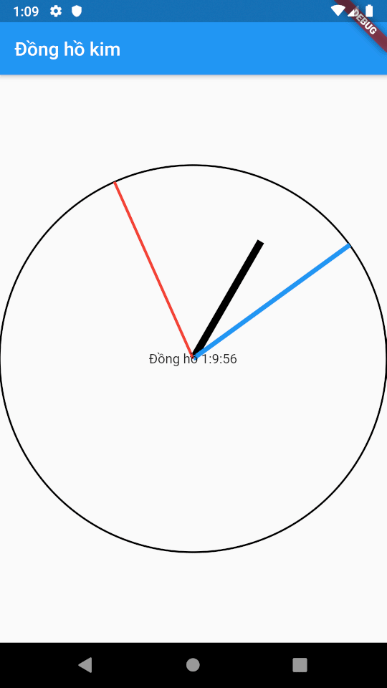
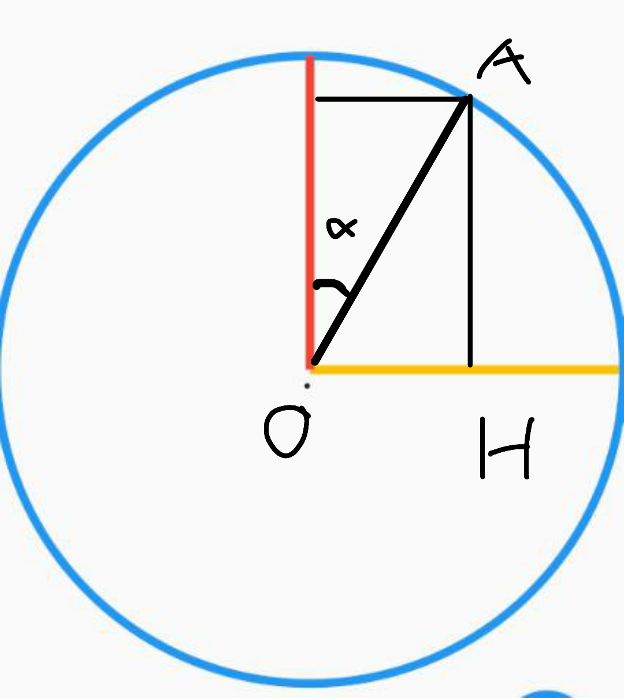
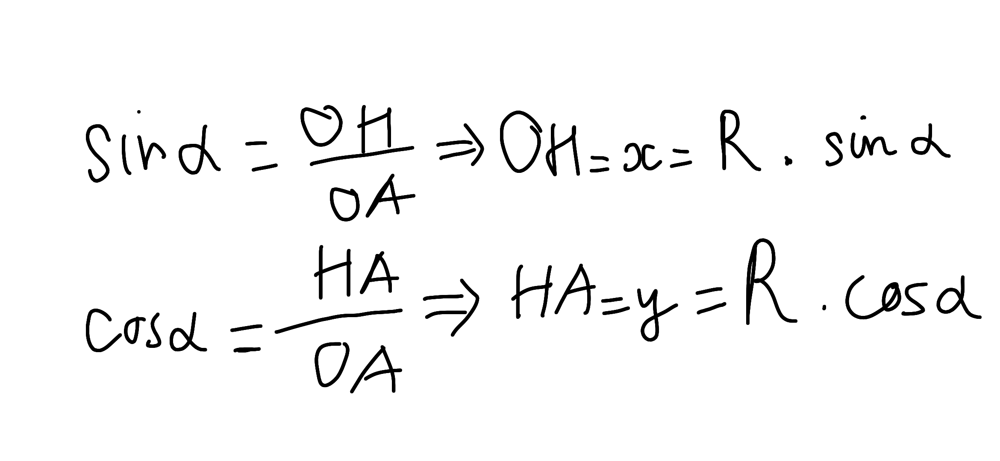
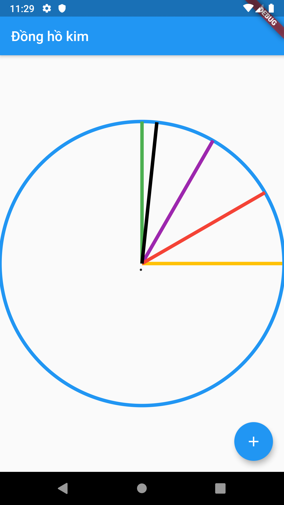
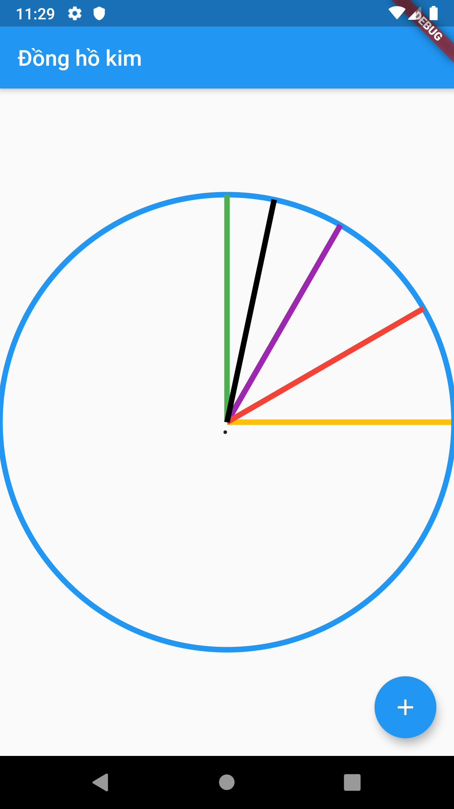
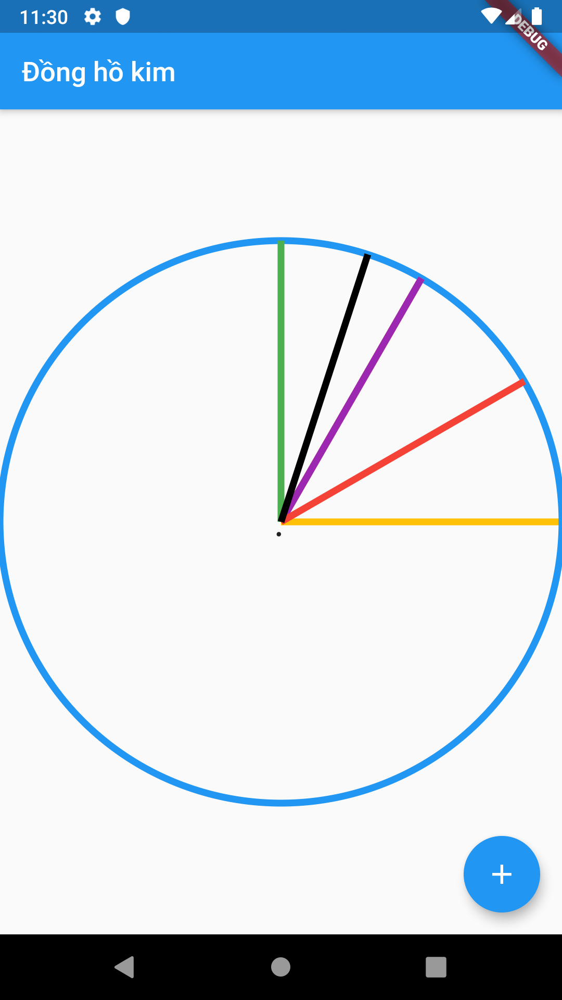
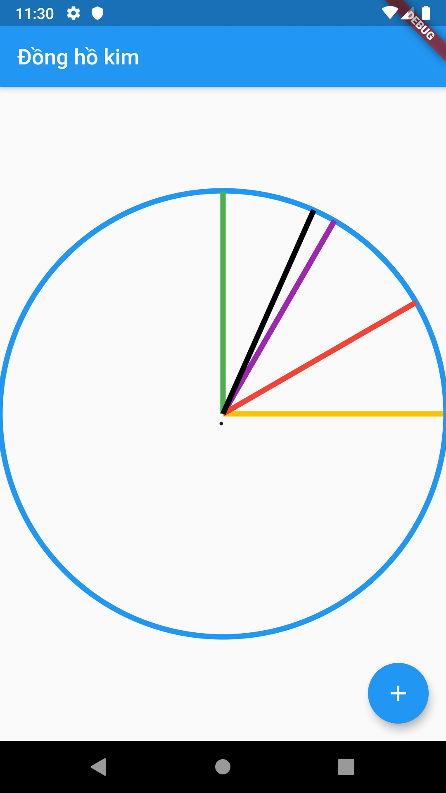
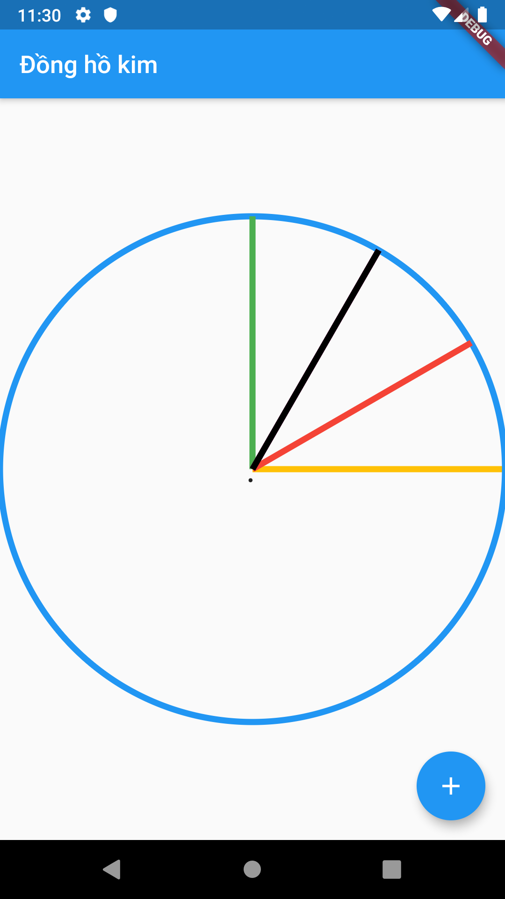

# Flutter Analog Clock

## Demo



-----

## Cách tính

Coi OA là kim đồng hồ. Tọa độ điểm O là `(width/2,height/2)`.

Theo lượng giác, tính được OA và HA -> **Tọa độ điểm A** là `(width/2 + OH, height/2 - HA)`

Theo công thức cos-sin, tính: 
```
HA = R*cos(alpha) = x
OH = R*sin(alpha) = y
```





-----

## Góc

- Mỗi vạch kim giờ là 1/12 vòng -> mỗi vạch ứng với 360/12=30 độ -> góc alpha là `gio*30`.
- Mỗi vạch kim phút, giây là 1/60 vòng -> mỗi vạch ứng với 360/60=6 độ -> góc alpha là `phut*6` hoặc `giay*6`.


-----

## Mỗi giây set lại State để cập nhật giao diện

```
void initState() {
    Timer.periodic(Duration(seconds: 1), (Timer t) => dongho());
    super.initState();
  }
```

-----


<table>
<tr>
<td> 
 <pre>
    double R = size.width / 2;
    double AH = (R*math.cos(toRadians(1minute*6)));
    double OH = (R*math.sin(toRadians(1minute*6)));
    canvas.drawLine(
      Offset(R, size.height / 2),
      Offset(R + OH,  size.height/2 - AH),
      paint,
    );
 </pre>
</td>
<td>
  
</td>
</tr>
<tr>
<td> 
 <pre>
    double R = size.width / 2;
    double AH = (R*math.cos(toRadians(2minute*6)));
    double OH = (R*math.sin(toRadians(2minute*6)));
    canvas.drawLine(
      Offset(R, size.height / 2),
      Offset(R + OH,  size.height/2 - AH),
      paint,
    );
 </pre>
</td>
<td>
  
</td>
</tr>
<tr>
<td> 
 <pre>
    double R = size.width / 2;
    double AH = (R*math.cos(toRadians(3inute*6)));
    double OH = (R*math.sin(toRadians(3minute*6)));
    canvas.drawLine(
      Offset(R, size.height / 2),
      Offset(R + OH,  size.height/2 - AH),
      paint,
    );
 </pre>
</td>
<td>
  
</td>
</tr>
<tr>
<td> 
 <pre>
    double R = size.width / 2;
    double AH = (R*math.cos(toRadians(4minute*6)));
    double OH = (R*math.sin(toRadians(4minute*6)));
    canvas.drawLine(
      Offset(R, size.height / 2),
      Offset(R + OH,  size.height/2 - AH),
      paint,
    );
 </pre>
</td>
<td>
  
</td>
</tr>
<tr>
<td> 
 <pre>
    double R = size.width / 2;
    double AH = (R*math.cos(toRadians(5minute*6)));
    double OH = (R*math.sin(toRadians(5minute*6)));
    canvas.drawLine(
      Offset(R, size.height / 2),
      Offset(R + OH,  size.height/2 - AH),
      paint,
    );
 </pre>
</td>
<td>
  
</td>
</tr>
</table>


## Tài liệu Tham khảo

 - [Cú pháp công thức toán học Dart](https://github.com/claudiodangelis/dart-samples/blob/master/math/math.dart)

  - [Cách vẽ canvas Flutter](https://hackernoon.com/drawing-custom-shapes-and-lines-using-canvas-and-path-in-flutter-997dfb8fde5a)
